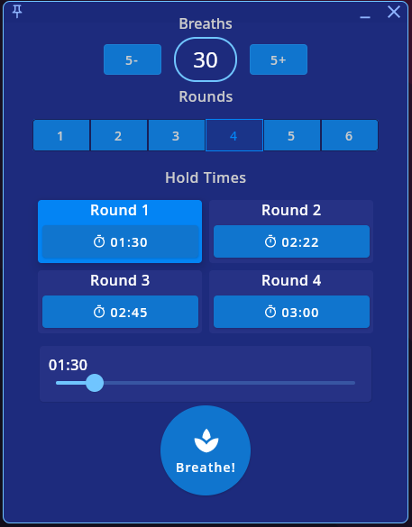
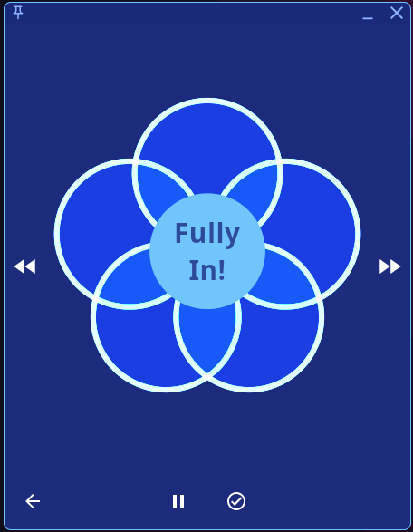

#  Ice Breathing WASM
Kotlin Multiplatform Wim Hof breathing-inspired breathing & meditation.
This is a temporary WASM compilation target repository, with Kotlin multiplatform scaffolding.

## Desktop Screenshot

Also see [Guided Wim Hof breathing example on YouTube](https://www.youtube.com/watch?v=tybOi4hjZFQ),
for an example of this breathing method.
